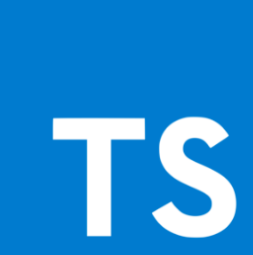

<h2>🔧 Languages and Tools:</h2>

  
   
   
  
  
  
  
   
   
  
  
  
  
  
  

## 📫 How to reach me:
- LinkedIn: [LinkedIn](https://www.linkedin.com/in/quynhanhnguyenho/)
- Email: rosenguyen1027@gmail.com
  

## 📁Highlight Projects
- [Portfolio](https://anhnguyenportfolio.netlify.app/): My portfolio website
- [Project management app](https://github.com/qinahros27/project-management-app): A Next.js project designed to streamline task and project management. 
- [E-commerce website](https://anhqsahara.netlify.app/): A React/Redux front-end application built on a public API.
- [Car showcase](https://car-showcase-eight-lake.vercel.app/): A car showcase webpage, where users can browse through a wide range of cars.
- [To-do app](https://qntodoapp.netlify.app/): To-do App offers a range of essential features, including the ability to add, edit, delete task or clear all tasks.
- [Spotify Clone](https://github.com/qinahros27/spotify-clone): A website where users can find songs that are available on Spotify, add them to a playlist, and then save them to their Spotify account.
- [Quotes collection](https://quotescollection.netlify.app/): A simple responsive web design using HTML and SCSS.
- [Tea store webpage](https://phenomenal-empanada-a4a809.netlify.app/): A simple web design using HTML.

